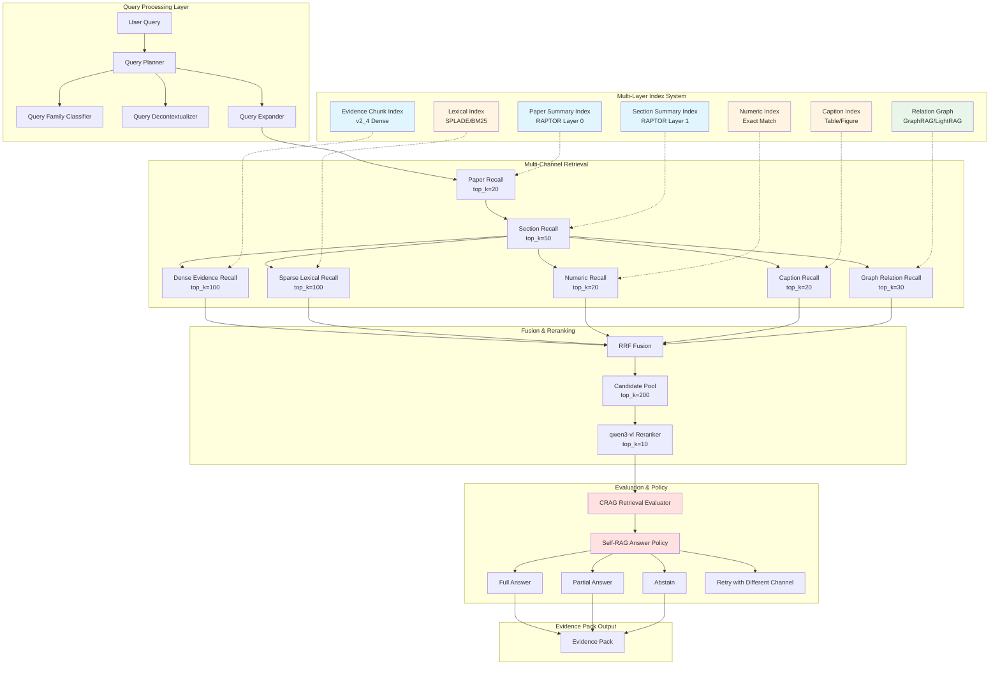
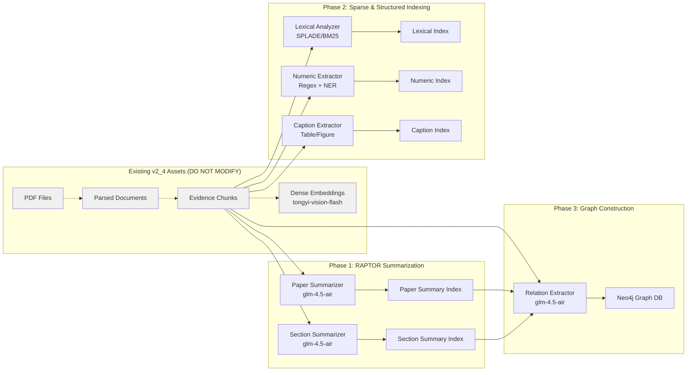

# Design Document: ScholarAI v3.0 Academic Retrieval Engine Redesign

## Overview

The ScholarAI v3.0 Academic Retrieval Engine represents a fundamental architectural upgrade from the v2_6_2 flat dense chunk retrieval system, which has demonstrated critical quality failures (recall@10 = 0.0, recall@100 = 0.0, same_paper_hit_rate = 0.2812, unsupported_claim_rate = 0.4896). This redesign implements a multi-layer, multi-channel hierarchical retrieval architecture inspired by state-of-the-art academic retrieval systems including RAPTOR (recursive abstractive processing), GraphRAG/LightRAG (graph-augmented retrieval), SPLADE/ColBERTv2 (sparse-dense hybrid retrieval), CRAG (corrective retrieval-augmented generation), and Self-RAG (self-reflective retrieval).

The core innovation is a hierarchical indexing and retrieval pipeline that operates across multiple semantic granularities (paper → section → evidence chunk) and multiple retrieval channels (dense semantic, sparse lexical, numeric exact-match, table/figure/caption, relation graph). The system employs a large candidate pool strategy with sophisticated fusion (Reciprocal Rank Fusion), reranking (qwen3-vl-rerank), retrieval quality evaluation (CRAG-style), and answer policy decision-making (Self-RAG-style full/partial/abstain).

This design maintains strict backward compatibility constraints: no PDF re-parsing, no re-chunking, no modification to the v2_4 evidence chunk collection, and preservation of the main embedding model (tongyi-embedding-vision-flash-2026-03-06). The implementation follows an 8-phase incremental delivery strategy with comprehensive regression testing at each phase boundary.

## Architecture

### System Architecture Overview



### Indexing Pipeline Architecture



### Query Flow Sequence Diagram

```mermaid
sequenceDiagram
    participant User
    participant QueryPlanner
    participant PaperRecall
    participant SectionRecall
    participant MultiChannel as Multi-Channel Retrieval
    participant RRFFusion
    participant Reranker as qwen3-vl Reranker
    participant Evaluator as CRAG Evaluator
    participant Policy as Self-RAG Policy
    participant EvidencePack
    
    User->>QueryPlanner: query, query_family, stage
    QueryPlanner->>QueryPlanner: classify query_family
    QueryPlanner->>QueryPlanner: decontextualize query
    QueryPlanner->>QueryPlanner: expand query variants
    
    QueryPlanner->>PaperRecall: expanded_queries, top_k=20
    PaperRecall->>PaperRecall: search paper_summary_index
    PaperRecall-->>QueryPlanner: paper_ids[20]
    
    QueryPlanner->>SectionRecall: paper_ids, queries, top_k=50
    SectionRecall->>SectionRecall: search section_summary_index
    SectionRecall-->>QueryPlanner: section_ids[50]
    
    par Dense Retrieval
        QueryPlanner->>MultiChannel: dense_search(section_ids, top_k=100)
        MultiChannel-->>RRFFusion: dense_candidates[100]
    and Sparse Retrieval
        QueryPlanner->>MultiChannel: sparse_search(section_ids, top_k=100)
        MultiChannel-->>RRFFusion: sparse_candidates[100]
    and Numeric Retrieval
        QueryPlanner->>MultiChannel: numeric_search(section_ids, top_k=20)
        MultiChannel-->>RRFFusion: numeric_candidates[20]
    and Caption Retrieval
        QueryPlanner->>MultiChannel: caption_search(section_ids, top_k=20)
        MultiChannel-->>RRFFusion: caption_candidates[20]
    and Graph Retrieval
        QueryPlanner->>MultiChannel: graph_search(paper_ids, top_k=30)
        MultiChannel-->>RRFFusion: graph_candidates[30]
    end
    
    RRFFusion->>RRFFusion: reciprocal_rank_fusion(all_candidates)
    RRFFusion-->>Reranker: fused_pool[200]
    
    Reranker->>Reranker: qwen3_vl_rerank(query, candidates)
    Reranker-->>Evaluator: reranked_top_k[10]
    
    Evaluator->>Evaluator: assess_retrieval_quality(query, candidates)
    Evaluator->>Evaluator: compute_coverage_metrics()
    
    alt Quality Sufficient
        Evaluator->>Policy: candidates, quality_score
        Policy->>Policy: decide_answer_mode(candidates, quality)
        
        alt Full Answer
            Policy-->>EvidencePack: mode=full, candidates[10]
        else Partial Answer
            Policy-->>EvidencePack: mode=partial, candidates[5], missing_evidence
        else Abstain
            Policy-->>EvidencePack: mode=abstain, reason
        end
    else Quality Insufficient
        Evaluator->>QueryPlanner: retry_signal, weak_reasons
        Note over QueryPlanner: Trigger second-pass retrieval
    end
    
    EvidencePack-->>User: EvidencePack with diagnostics
